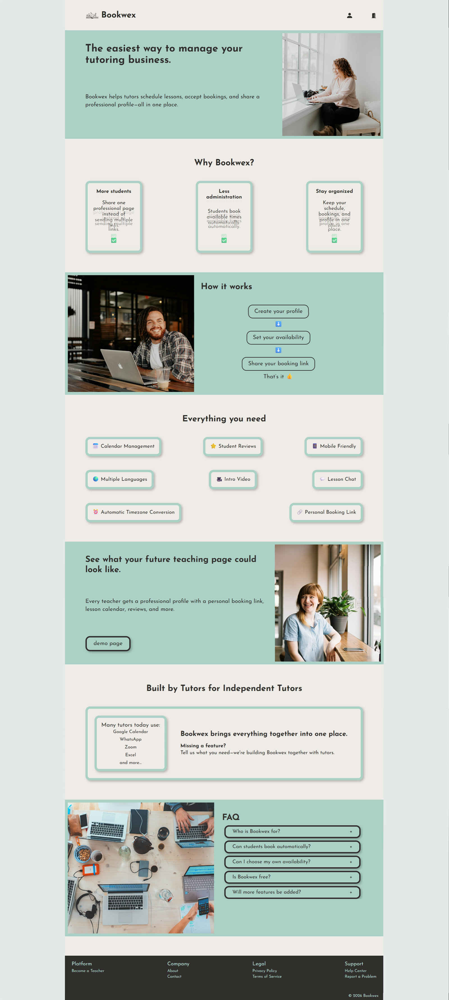
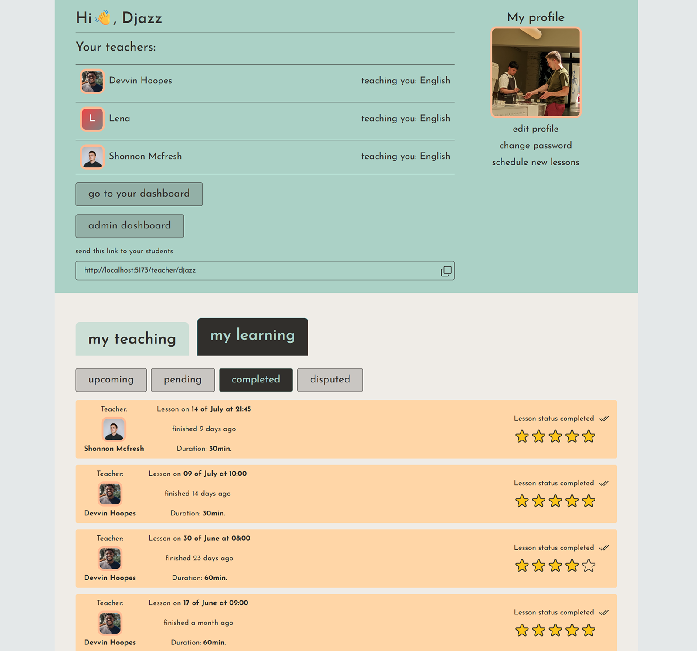
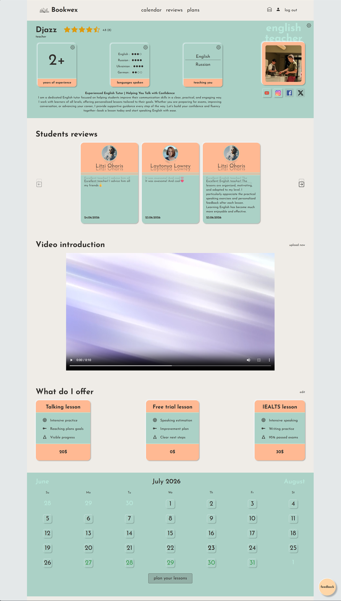
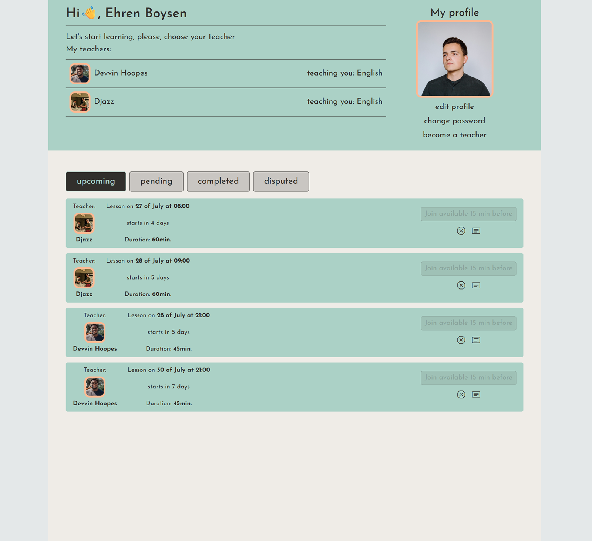
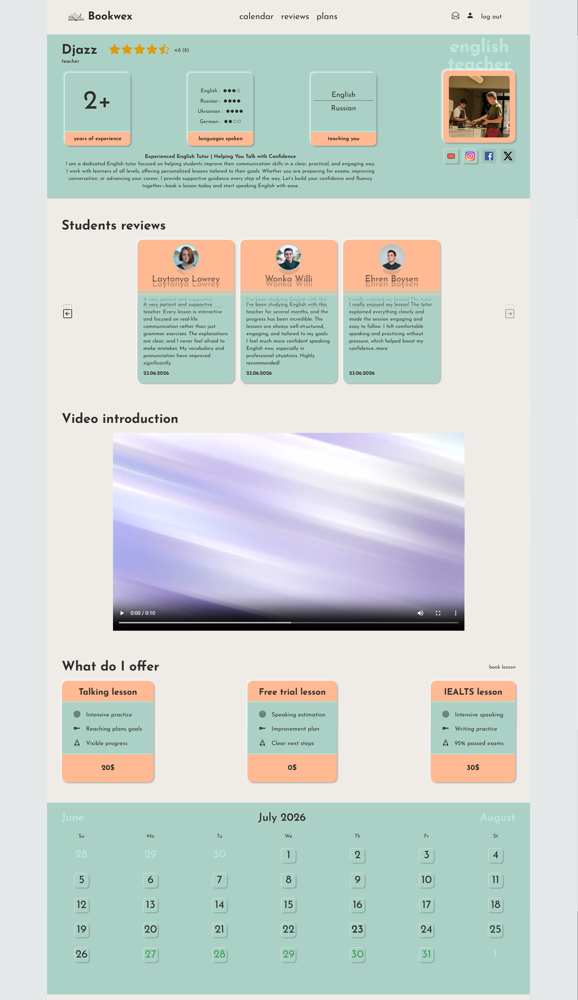
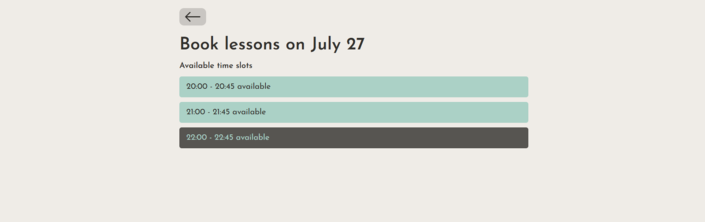
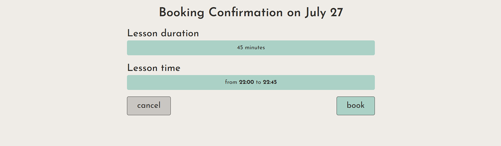
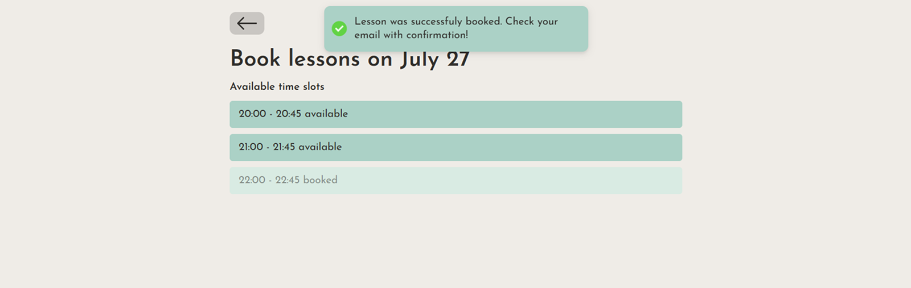

# Bookwex

> A modern SaaS platform helping independent tutors manage their teaching business.


## Introduction

Bookwex is an all-in-one platform designed for independent tutors.

It enables tutors to create professional profiles, manage lesson availability, accept bookings, receive reviews, and provide students with a seamless booking experience.

The goal is to reduce administrative work so tutors can spend more time teaching.

## Screenshots

### Home Page

<p align="center">
  
</p>

### Teacher Dashboard



### Teacher Public Profile



### Student Dashboard



### Student's view of Teacher Profile



### Booking flow







## Highlights

- 🚀 SaaS platform
- 🔐 Authentication & role-based authorization
- 📅 Timezone-aware booking engine
- ⭐ Teacher review system
- 💬 Real-time chat
- 📱 Responsive design
- 🌍 SEO optimized
- ☁️ Production deployment

## Live Demo

🌐 **https://bookwex.com**

Currently in Public Beta.

## Features

### Teacher Experience

- Professional public profiles
- Weekly availability management
- Booking management
- Student reviews
- Intro video
- Dashboard
- Chat with student
- Founder Tutor Program

### Student Experience

- Book lessons
- View teacher profiles
- Manage bookings
- Leave reviews
- Chat with teacher

### Platform

- Authentication
- Responsive design
- SEO optimized
- Timezone support
- Image uploads
- Protected routes

## Development Principles

- Component-first architecture
- Mobile-first responsive design
- Type-safe development with TypeScript
- Secure backend with PostgreSQL Row Level Security
- Reusable and maintainable codebase
- Accessibility and performance focused

## Engineering Highlights

- Timezone-aware booking system
- PostgreSQL Row Level Security
- Role-based authentication
- Optimistic UI with React Query
- Dynamic teacher profile routing
- Responsive mobile design
- SEO optimization
- Reusable component architecture

## Tech Stack

### Frontend

- ⚛ React
- 📘 TypeScript
- ⚡ Vite
- 🎨 Tailwind CSS
- 🌴 React Router
- ☑️ React Hook Form
- 🔄 React Query

### Backend

- ⚡ Supabase
- 🐘 PostgreSQL
- 📝 Authentication
- 🫙 Storage
- ®️ Resend

### Deployment

- ✌️ Vercel
- ☁️ Cloudflare DNS

### Development

- 🔷 ESLint
- 🅿️ Prettier
- 🐈‍⬛ Git
- 🐈‍⬛ GitHub

## Architecture

```text
                 Users
                   │
      React + TypeScript (Frontend)
                   │
             React Query
                   │
          Supabase Backend
      ┌────────┼────────┐
      │        │        │
    Auth   PostgreSQL  Storage
```

## Project Structure

```text
src/
│
├── api/
├── assets/
├── components/
├── context/
├── helpers/
├── mappers/
├── routes/
├── types/
└── ui/
```

## Technical Challenges

### Timezone-aware Scheduling

Lesson times are stored in UTC and converted to each user's local timezone to ensure accurate booking across regions.

### Security

Access control is implemented using PostgreSQL Row Level Security policies, allowing only authorized users to access or modify data.

### Scalability

The project uses reusable components, modular API services, and feature-based organization to support future growth.

### Performance

React Query is used for caching and background synchronization, minimizing unnecessary network requests while keeping the UI responsive.

## Engineering Decisions

### Why Supabase?

Supabase provides authentication, PostgreSQL, storage, and Row Level Security, allowing a secure backend while keeping development focused on product features.

### Why React Query?

React Query simplifies server-state management, caching, optimistic updates, and synchronization across the application.

### Why UTC?

All lesson times are stored in UTC to ensure accurate scheduling across multiple time zones.

## Roadmap

### Completed

- Authentication
- Teacher profiles
- Booking system
- Reviews
- Chats
- Email notifications(partly completed)
- Founder Program

### In Progress

- Email notifications
- Payments
- Student dashboard improvements

### Planned

- Mobile app
- AI assistant
- Analytics
- Team accounts

## About

Bookwex is independently designed and developed by Oljas Medetbaev.

The project combines modern frontend technologies with a scalable backend architecture to provide independent tutors with professional tools for managing their teaching business.

The project began with a simple idea: give independent tutors professional tools that help them manage and grow their teaching business from one place.

Bookwex continues to evolve through feedback from early users during its public beta.

## Vision

Bookwex aims to become the all-in-one platform for independent tutors, combining scheduling, communication, payments, and business management into a single, easy-to-use application.

## Contact

Website:
https://bookwex.com

Email:
hello@bookwex.com

---

⭐ If you found this project interesting, feel free to explore the live demo or get in touch.

Built with ❤️ by Oljas Medetbaev
